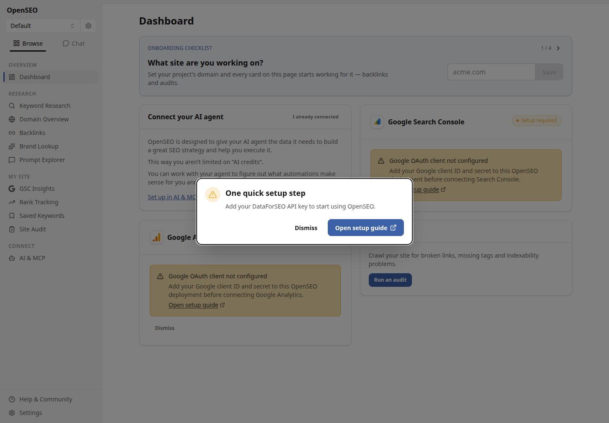
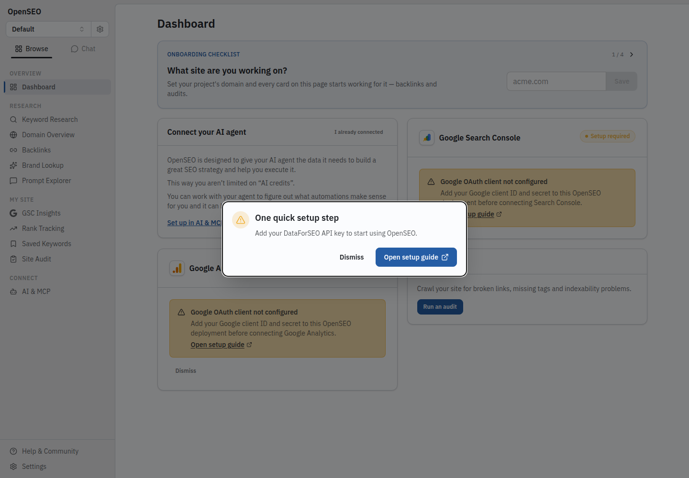
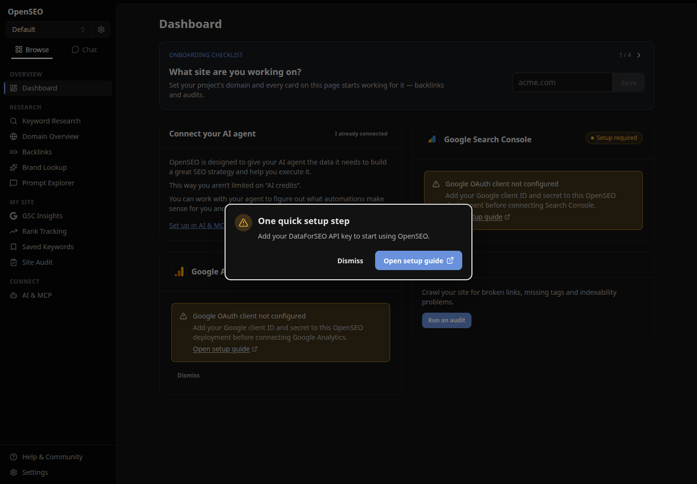
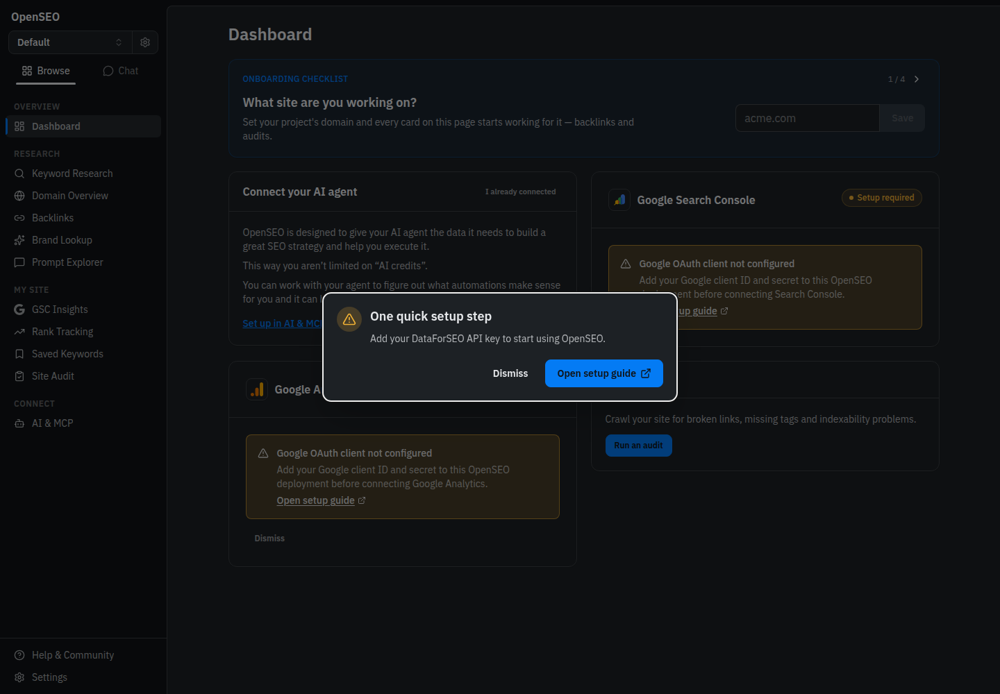

# TM-097 OpenSEO adoption review

Prepared for owner and upstream maintainer review; not accepted or closed. Base: upstream every-app/open-seo main at 3632f40. This is the application under src/, not the separate web/ marketing site or badseo/ fixture.

## Change

Pinned design-tokens and design-client to 2.2.1, added the openseo pin with no siblings, and synced 35 release-context files. The published release source is recorded in lock.json. The application imports packaged tokens and local fonts; DaisyUI's existing base, primary and accent aliases now consume those tokens. Existing theme storage, OS preference and pre-hydration initialization set both DaisyUI and ByteDesk theme attributes. The HTML root carries the openseo product scope. IBM Plex Sans replaces default system Sans and local monospace utility mapping, as specified by the released profile. Layout, spacing, radii, routes and data flows are unchanged.

Specialist chart, score-tier, tag-chip and remaining DaisyUI secondary/semantic palettes remain local. This is an adoption slice, not a claim of full visual conformance or a redesign. No design-ui dependency is needed, so Node ESM component resolution is not involved.

## Visible comparison

Real local application dashboard at 1440 by 1000, Chrome 152, DPR 1. A fresh local D1 database was migrated and the supported local_noauth mode selected in an untracked .dev.vars file. No provider credentials, external research, audits, billing or deployment were used. The dashboard truthfully reports missing Google and DataForSEO setup. The before and after comparisons include that existing setup dialog; additional after screenshots show the dashboard after dismissing it.

| Theme | Before primary      | After primary | Before canvas  | After canvas |
| ----- | ------------------- | ------------- | -------------- | ------------ |
| Dark  | oklch(66% 0.12 262) | #047BF4       | oklch(12% 0 0) | #101316      |
| Light | oklch(50% 0.12 262) | #255DA5       | oklch(97% 0 0) | #ECEDEF      |

The visible changes are family blue actions, canonical neutral planes/text/borders and IBM Plex Sans. Text widths naturally change with the font. Geometry is not restyled. Raw observations are [before.json](before.json), [after.json](after.json) and [controls.json](controls.json).

| Before light                      | After light                     |
| --------------------------------- | ------------------------------- |
|  |  |

| Before dark                     | After dark                    |
| ------------------------------- | ----------------------------- |
|  |  |

Dashboard without the setup dialog: [light](dashboard-light.png), [dark](dashboard-dark.png).

Agent-browser refused connection at 127.0.0.1:9224. The disclosed fallback was Chrome/Playwright, not deployed acceptance. Capture helpers are included; run from the repository root with the local Vite app on port 4334. PLAYWRIGHT_MODULE can select a local Playwright installation.

## Verification and limitations

- Frozen dependency installation passed. Initial resolution used a command-local minimum-release-age override for the explicitly requested 2.2.1 packages; the repository's eight-day policy was not disabled or widened. Lock diff contains only those two packages.
- Existing suite: 138 files, 1,165 tests passed. New theme bridge suite: five tests passed, including manual preference against the opposite OS, system light/dark, and unavailable storage fallback.
- pnpm build passed: browser and Worker SSR bundles plus TypeScript. Existing large-chunk warnings remain.
- pnpm ci:check passed: formatting, Knip, application and fixture typechecks, lint (zero warnings/errors) and plugin-skill drift check. Knip excludes generated context and recognizes the CSS-only token import; Prettier preserves locked upstream bytes.
- Offline sync passed: 35 files match, using the installed client with sudo unshare -n, env -i and empty HOME. Network unavailable and no credentials inherited. Dependency installation is a separate operation; CI uses the committed scoped registry URL and lock, never downloads the checker during sync --check.
- Browser controls: six of eight passed. Explicit light/dark preferences override the opposite OS in both layers, setup dialog dismissal and Settings navigation pass. The first Tab after dialog dismissal left focus on BODY rather than a focusable control in either theme; keyboard focus restoration remains a recorded limitation, not a passing check. No attempt was made to tune the existing modal in this adoption.
- Neither theme has horizontal document overflow at the measured 1440px viewport. This is not a responsive acceptance matrix.
- The existing dialog outline and unmigrated specialist palettes remain visible. Missing-provider messages are expected local configuration state, not evidence of provider functionality.

The GitHub Node/pnpm lane now runs design:check after installation. .github changes require explicit maintainer review under the existing CODEOWNERS rule (@bensenescu). Remote CI, deployment and approval are not established by these local runs. The separate website and Docker jobs remain unchanged and were not run locally.

## Reproduce offline check

From the application root, after dependency installation:

```sh
mkdir -p /tmp/openseo-empty-home
sudo unshare -n env -i HOME=/tmp/openseo-empty-home PATH=/usr/bin:/bin \
  /usr/bin/node "$PWD/node_modules/@bytedesk/design-client/cli.mjs" sync --check
```

Normal CI uses pnpm run design:check. Refresh with pnpm run design:sync only when an approved pin changes, then commit the generated tree and lock. Source and image hashes are recorded in verification.json.
